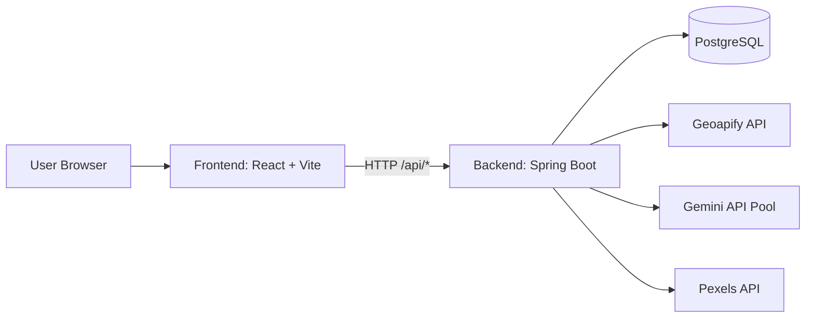
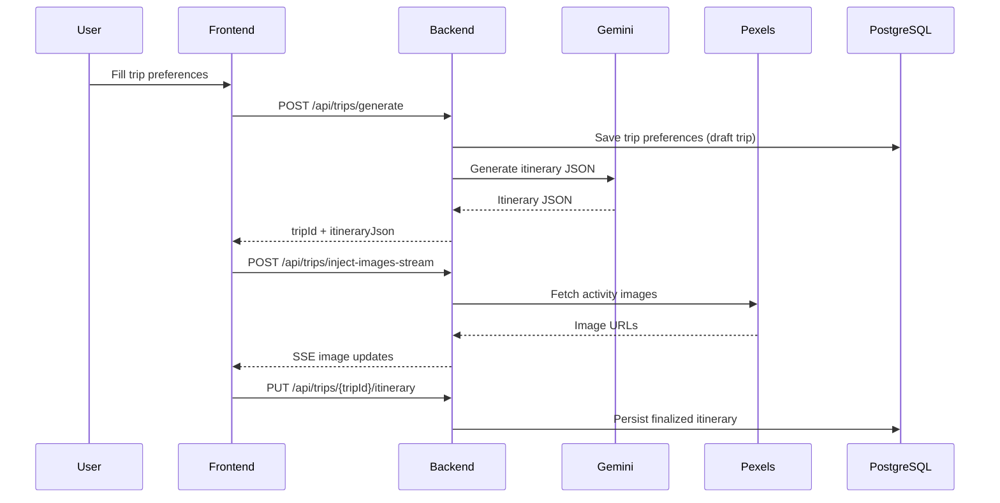
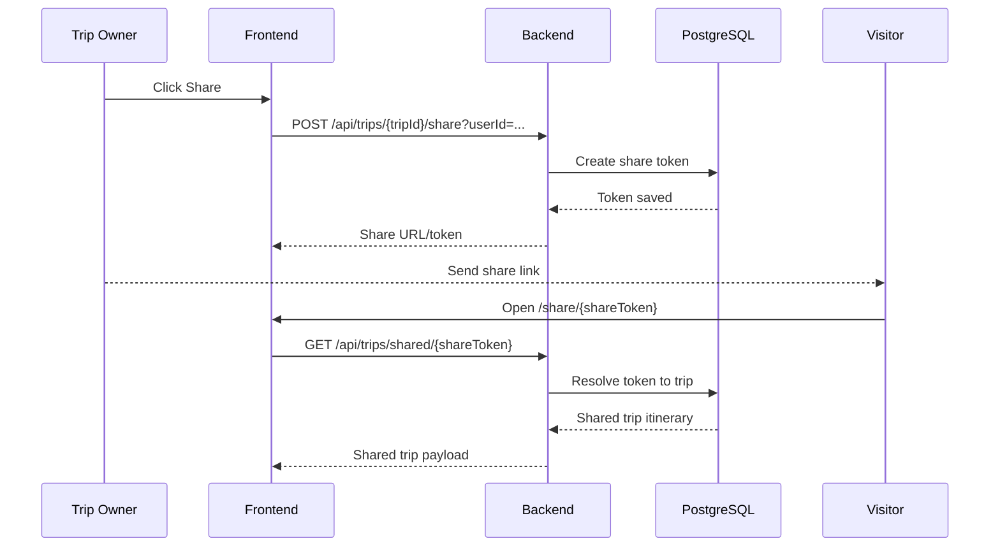

# Voyexa

AI-powered travel planning platform with a **React + Vite frontend** and a **Spring Boot backend** for trip generation, itinerary customization, profile-based planning, and shareable trips.

## Table of Contents
- [Motivation](#motivation)
- [Features](#features)
- [Tech Stack](#tech-stack)
- [Project Structure](#project-structure)
- [System Architecture and Flows](#system-architecture-and-flows)
- [Installation](#installation)
- [Configuration](#configuration)
- [Usage](#usage)
- [Development](#development)
- [Testing](#testing)
- [Deployment](#deployment)
- [Known Issues](#known-issues)
- [Roadmap](#roadmap)
- [Contributing](#contributing)
- [License](#license)

## Motivation
Planning trips usually means switching between destination search, activity planning, and itinerary edits across multiple tools. Voyexa combines that flow into one app:
- discover destinations,
- generate AI itineraries,
- refine days/activities,
- and share trips through public links.

## Features
- **Guided trip creation flow** with location autocomplete and traveler preferences.
- **AI itinerary generation** and post-processing with images.
- **Day-wise itinerary editing** including drag-and-drop day reordering.
- **Alternative activity generation** (on-demand and cached variants).
- **Trip sharing** via tokenized share links.
- **Traveler profiles** for repeated planning.
- **Dashboard trending destinations** endpoint for discovery UX.

## Tech Stack
| Layer | Technology |
|---|---|
| Frontend | React 18, Vite, Tailwind CSS, React Router |
| UI/Interaction | dnd-kit, Lucide, GSAP/Lenis |
| Backend | Java 21, Spring Boot 4, Spring Web, Spring Data JPA, Spring Security |
| Data | PostgreSQL, Flyway |
| External APIs | Gemini (planning/validation), Geoapify (place search), Pexels (images) |

## Project Structure
```text
Voyexa/
├─ frontend/                 # React app (Vite)
│  ├─ src/pages
│  ├─ src/components
│  ├─ src/services
│  └─ src/utils
├─ backend/
│  └─ backend/               # Spring Boot application root
│     ├─ src/main/java/com/voyexa/backend
│     ├─ src/main/resources
│     └─ pom.xml
└─ README.md
```

## System Architecture and Flows
### 1. High-level architecture


### 2. Trip generation flow


### 3. Shared trip flow


## Installation
### Prerequisites
1. **Node.js** 18+ (recommended 20+)
2. **Java** 21
3. **Maven** (or use included Maven wrapper)
4. **PostgreSQL** database

### 1. Clone
```bash
git clone <your-repo-url>
cd Voyexa
```

### 2. Frontend setup
```bash
cd frontend
npm install
```

### 3. Backend setup
```bash
cd ..\backend\backend
.\mvnw.cmd clean install
```

## Configuration
Backend reads configuration from environment variables (`application.yaml`) and optional `env.properties`.

Use `backend\backend\.env.example` as your reference and define these values in your environment:

| Variable | Purpose |
|---|---|
| `DB_URL` | PostgreSQL JDBC URL |
| `DB_USER` / `DB_USERNAME` | DB username |
| `DB_PASS` / `DB_PASSWORD` | DB password |
| `PORT` | Backend port (default: `8080`) |
| `CORS_ALLOWED_ORIGINS` | Allowed frontend origins |
| `GEOAPIFY_API_KEY` | Place autocomplete API key |
| `GEMINI_API_KEYS` / `GEMINI_PLANNER_API_KEY` | Itinerary generation keys |
| `GEMINI_LIMITED_API_KEYS` / `GEMINI_VALIDATOR_API_KEY` | Validator/limited usage keys |
| `PEXELS_API_KEY` | Activity image lookup key |

Frontend environment:
- `frontend\.env.production` expects:
  - `VITE_API_URL=https://<my-backend-url>`

For local development, set `VITE_API_URL=http://localhost:8080` in `frontend\.env` (or rely on Vite proxy for compatible requests).

## Usage
### Run backend
From `backend\backend`:
```bash
.\mvnw.cmd spring-boot:run
```

Health checks:
- `GET /` -> service status payload
- `GET /health` -> lightweight health response

### Run frontend
From `frontend`:
```bash
npm run dev
```
Open the Vite URL (typically `http://localhost:5173`).

### Key API routes
- `POST /api/users/register` and `POST /api/users/login`
- `GET /api/dashboard/trending`
- `GET /api/trips/places/search?query=...`
- `POST /api/trips/generate`
- `POST /api/trips/inject-images-stream`
- `POST /api/trips/{tripId}/alternatives/on-demand`
- `PUT /api/trips/{tripId}/reorder`
- `POST /api/trips/{tripId}/share`
- `GET /api/trips/shared/{shareToken}`
- `GET/POST/PUT/DELETE /api/traveler-profiles/...`

## Development
Frontend commands (`frontend`):
- `npm run dev` - start dev server
- `npm run build` - production build
- `npm run preview` - preview built app
- `npm run lint` - lint frontend source

Backend commands (`backend\backend`):
- `.\mvnw.cmd spring-boot:run` - run backend locally
- `.\mvnw.cmd test` - run tests
- `.\mvnw.cmd clean package` - create runnable JAR

## Testing
- **Frontend:** linting configured via ESLint (`npm run lint`).
- **Backend:** JUnit/Spring tests via Maven (`.\mvnw.cmd test`).

## Deployment
### Backend (Docker)
`backend\backend\Dockerfile` builds and runs the Spring Boot JAR.

Build example:
```bash
docker build -f backend\backend\Dockerfile -t voyexa-backend .
```

Run example:
```bash
docker run -p 8080:8080 --env-file <env-file> voyexa-backend
```

### Frontend
Build and deploy static assets from `frontend\dist`:
```bash
cd frontend
npm run build
```
Configure `VITE_API_URL` for the deployed backend before build.

## Known Issues
- API-backed features require valid third-party keys (Gemini, Geoapify, Pexels).
- Some frontend calls depend on `VITE_API_URL`; ensure it is set correctly per environment.
- Backend folder is nested at `backend\backend`, which is intentional in current layout.

## Roadmap
- Add authenticated authorization rules beyond open endpoint policy.
- Add broader integration/end-to-end test coverage.
- Improve API documentation (OpenAPI/Swagger publishing).
- Expand itinerary export/share formats.

## Contributing
1. Fork the repository and create a feature branch.
2. Keep changes scoped and include tests where relevant.
3. Run frontend lint and backend tests before opening a PR.
4. Submit a pull request with a clear change summary.

## License
Currently marked as **ISC** in root package metadata. Add/update a top-level `LICENSE` file if you want an explicit project-wide license document.
